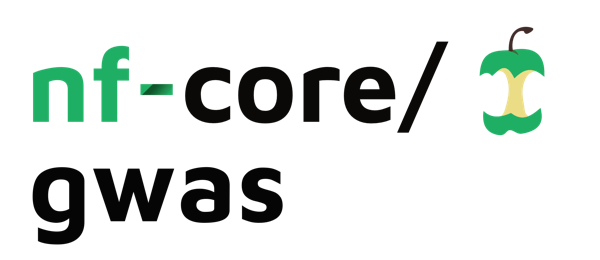
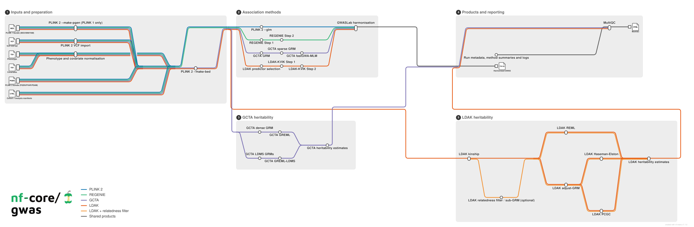

<h1>
  <picture>
    <source media="(prefers-color-scheme: dark)" srcset="docs/images/nf-core-gwas_logo_dark.png">
    
  </picture>
</h1>

[](https://github.com/codespaces/new/nf-core/gwas)
[](https://github.com/nf-core/gwas/actions/workflows/nf-test.yml)
[](https://github.com/nf-core/gwas/actions/workflows/linting.yml)[](https://nf-co.re/gwas/results)[](https://doi.org/10.5281/zenodo.XXXXXXX)
[](https://www.nf-test.com)

[](https://www.nextflow.io/)
[](https://github.com/nf-core/tools/releases/tag/4.0.3)
[](https://docs.conda.io/en/latest/)
[](https://www.docker.com/)
[](https://sylabs.io/docs/)
[](https://cloud.seqera.io/launch?pipeline=https://github.com/nf-core/gwas)

[](https://nfcore.slack.com/channels/gwas)[](https://bsky.app/profile/nf-co.re)[](https://mstdn.science/@nf_core)[](https://www.youtube.com/c/nf-core)

## Introduction

**nf-core/gwas** is a bioinformatics pipeline for association, individual-level and summary-level heritability, and declared pairwise genetic-correlation analysis. A cohort manifest owns genotype facts, an analysis manifest links traits and individual-level methods to those cohorts, a summary-statistics manifest declares external or pipeline-generated summary results and their unary methods, and an optional relationship manifest binds explicit analysis or summary endpoints. The pipeline reuses compatible work, retains native results, and converges every summary result on one versioned canonical contract.

Genotype quality control is not performed by the pipeline. Input genotypes must already have suitable samples, variants, alleles, coordinates, genome build and analysis filters.



## Pipeline summary

1. Validate linked cohort, analysis, summary-statistics, relationship, reference and request declarations.
2. Prepare each distinct cohort once from PLINK 2, PLINK 1 or VCF input.
3. Normalise the selected phenotype and optional quantitative and categorical covariates.
4. Run selected association routes:
   - PLINK 2 `--glm`
   - REGENIE
   - GCTA fastGWA-MLM
   - LDAK-KVIK
5. Assign every association result a stable `<analysis_id>--<association_method>` summary-statistics identity and standardise it with GWASLab while preserving the native result.
6. Ingest external raw summary statistics through an explicit named GWASLab format, or validate already-canonical external tables without reharmonising them.
7. Build and reuse relatedness matrices for selected heritability routes:
   - GCTA GREML
   - GCTA GREML-LDMS
   - LDAK REML
   - LDAK Haseman-Elston regression
   - LDAK PCGC
8. Resolve declared unary and pair summary-statistics requests against explicit LDAK or LDSC reference bundles, including LDAK SumHer heritability and SumCors genetic correlation.
9. Run declared same-cohort pairs with dense or LDMS GCTA bivariate REML, retaining native output plus normalized heritability, genetic-covariance, genetic-correlation, diagnostics and request provenance.
10. Run declared LDSC H2 and ordered RG requests, reusing content-identical munging and retaining observed- and available liability-scale native results plus normalized estimand views, diagnostics and provenance.
11. Collect run and software provenance with MultiQC and Nextflow reports.

## Usage

> [!NOTE]
> If you are new to Nextflow and nf-core, please refer to [this page](https://nf-co.re/docs/get_started/environment_setup/overview) on how to set-up Nextflow. Make sure to [test your setup](https://nf-co.re/docs/get_started/run-your-first-pipeline) with `-profile test` before running the workflow on actual data.

Prepare a cohort manifest and an analysis manifest linked by `cohort_id`. Advanced per-analysis
scientific settings and stageable resources may be supplied in an optional method-options JSON
document.

```csv title="cohorts.csv"
cohort_id,genome_build,ancestry,pgen,psam,pvar,bed,bim,fam,vcf
my_cohort,GRCh37,EUR,/data/my_cohort.pgen,/data/my_cohort.psam,/data/my_cohort.pvar,,,,
```

```csv title="analyses.csv"
analysis_id,cohort_id,trait_id,trait_type,phenotype,phenotype_column,control_value,case_value,quant_covariates,cat_covariates,association_methods,heritability_methods,population_prevalence,sample_prevalence
height,my_cohort,height,quantitative,/data/phenotypes.tsv,height,,,,,plink2,,,
```

Runnable minimal and heterogeneous examples are available under [`assets/examples/relational/`](assets/examples/relational/).

To ingest external summaries or select unary summary methods for a pipeline-generated association result, add the summary-statistics manifest. To request pairwise analysis, add the optional eight-column relationship manifest; no pair is inferred. GCTA pairs accept two distinct analysis IDs from the same cohort and select `gcta_bivariate_reml`, `gcta_bivariate_reml_ldms` or both. Summary requests select one named LDAK or LDSC bundle through `--method_options`, with the staged resource roles declared once in `--reference_catalog`.

Then run:

```bash
nextflow run nf-core/gwas \
    -r <VERSION> \
    -profile docker \
    --cohort_manifest cohorts.csv \
    --analysis_manifest analyses.csv \
    --relationship_manifest relationships.csv \
    --outdir results
```

> [!WARNING]
> Please provide pipeline parameters via the CLI or Nextflow `-params-file` option. Custom config files including those provided by the `-c` Nextflow option can be used to provide any configuration _**except for parameters**_; see [docs](https://nf-co.re/docs/running/run-pipelines#using-parameter-files).

For more details and further functionality, please refer to the [usage documentation](https://nf-co.re/gwas/usage) and the [parameter documentation](https://nf-co.re/gwas/parameters).

## Pipeline output

Native association results are published under `association/<method>/<analysis_id>/`. Every internal or external summary result is published once under `summary_statistics/<summary_statistics_id>/` as `<summary_statistics_id>.canonical.tsv.gz` plus a provenance sidecar. Individual-level heritability estimates remain under `heritability/individual/<method>/<analysis_id>/`. Declared GCTA and LDSC requests publish native results, diagnostics and provenance under `requests/<method>/<request_id>/` plus normalized estimand views under `heritability/`, `genetic_covariance/` and `genetic_correlation/`. Munged LDSC summaries and other intermediates are not republished; prepared genotypes, normalised phenotypes, relatedness matrices and REGENIE predictions remain unpublished unless their save controls are enabled.

For exact filenames, provenance lookup and optional output, see the [output documentation](https://nf-co.re/gwas/output).

## Credits

nf-core/gwas was originally written by Chris Wyatt, Fernando Duarte, Maxime Laurent.

We thank the following people for their extensive assistance in the development of this pipeline:

- [lyh970817](https://github.com/lyh970817)

## Contributions and Support

If you would like to contribute to this pipeline, please see the [contributing guidelines](docs/CONTRIBUTING.md).

For further information or help, don't hesitate to get in touch on the [Slack `#gwas` channel](https://nfcore.slack.com/channels/gwas) (you can join with [this invite](https://nf-co.re/join/slack)).

## Citations

<!-- TODO nf-core: Add the pipeline citation when a Zenodo DOI is available, then update the badge above. -->
<!-- If you use nf-core/gwas for your analysis, please cite it using the following doi: [10.5281/zenodo.XXXXXX](https://doi.org/10.5281/zenodo.XXXXXX) -->

An extensive list of references for the tools used by the pipeline can be found in the [`CITATIONS.md`](CITATIONS.md) file.

You can cite the `nf-core` publication as follows:

> **The nf-core framework for community-curated bioinformatics pipelines.**
>
> Philip Ewels, Alexander Peltzer, Sven Fillinger, Harshil Patel, Johannes Alneberg, Andreas Wilm, Maxime Ulysse Garcia, Paolo Di Tommaso & Sven Nahnsen.
>
> _Nat Biotechnol._ 2020 Feb 13. doi: [10.1038/s41587-020-0439-x](https://dx.doi.org/10.1038/s41587-020-0439-x).
